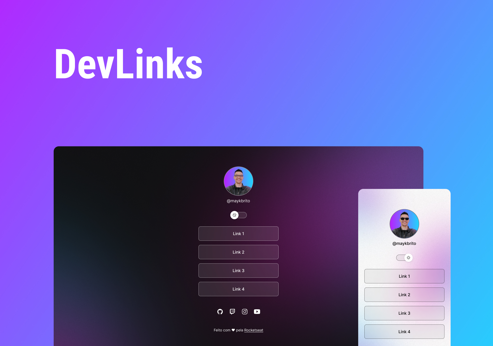

<h1 align="center">🍬 AnalluDoces — DevLinks</h1>

<p align="center">
  Agregador de links personalizado para a confeitaria <strong>AnalluDoces</strong>, desenvolvido como cartão de visitas online para uso em bio de redes sociais.
</p>

<p align="center">
  
  
  
  
</p>

<p align="center">
  <a href="#-sobre-o-projeto">Sobre</a>&nbsp;&nbsp;|&nbsp;&nbsp;
  <a href="#-funcionalidades">Funcionalidades</a>&nbsp;&nbsp;|&nbsp;&nbsp;
  <a href="#-tecnologias">Tecnologias</a>&nbsp;&nbsp;|&nbsp;&nbsp;
  <a href="#-como-executar">Como executar</a>&nbsp;&nbsp;|&nbsp;&nbsp;
  <a href="#-autor">Autor</a>
</p>

<br/>

<p align="center">
  
</p>

---

## 📌 Sobre o projeto

O **AnalluDoces DevLinks** é uma página de agregador de links construída para a confeitaria **AnalluDoces**, servindo como ponto central de acesso aos canais de atendimento, cardápios e redes sociais da marca.

O projeto foi desenvolvido durante o evento **Discover** da [Rocketseat](https://rocketseat.com.br) e personalizado para uso real em produção, com identidade visual própria da confeitaria.

### 🔗 Links disponíveis na página

- Pedidos via WhatsApp
- Cardápio de Páscoa (PDF)
- Cardápio de Bolos (PDF)
- Cardápio de Doces (PDF)

---

## ✨ Funcionalidades

- **Modo claro/escuro** com alternância animada via toggle
- **Animação de doces** caindo pela tela (🍬🍭🍫🍩🍪🧁)
- **Layout responsivo** — adaptado para mobile e desktop com backgrounds distintos
- **Links diretos** para WhatsApp, Instagram e cardápios em PDF
- **Footer animado** com efeito de batimento no ícone ♥
- **Efeito glassmorphism** nos botões de link

---

## 🚀 Tecnologias

- **HTML5**
- **CSS3** — variáveis CSS, animações, backdrop-filter, media queries
- **JavaScript** — manipulação de DOM, `setInterval`, criação dinâmica de elementos
- **Ion Icons** — biblioteca de ícones para os links sociais
- **Google Fonts** — tipografia Inter
- **Git & GitHub** — versionamento

---

## 💻 Como executar

```bash
# Clone o repositório
git clone https://github.com/seu-usuario/seu-repositorio.git

# Acesse a pasta do projeto
cd seu-repositorio

# Abra com Live Server (VS Code) ou diretamente no navegador
# Extensões recomendadas estão em .vscode/extensions.json
```

> **Recomendado:** usar a extensão [Live Server](https://marketplace.visualstudio.com/items?itemName=ritwickdey.LiveServer) no VS Code para visualizar as alterações em tempo real.

---

## 🎨 Layout

O layout base do projeto pode ser visualizado pelo [Figma](https://www.figma.com/community/file/1187422022288947321). É necessário ter uma conta no Figma para acessá-lo.

---

## 🧩 Extensões recomendadas (VS Code)

| Extensão            | Descrição                     |
| ------------------- | ----------------------------- |
| Prettier            | Formatação de código          |
| Material Icon Theme | Ícones de arquivos            |
| Omni Theme          | Tema de cores                 |
| Live Server         | Servidor local com hot reload |

---

## :memo: Licença

Este projeto está sob a licença MIT. Veja o arquivo [LICENSE](LICENSE) para mais detalhes.

---

## 👨‍💻 Autor

Feito com ♥ por **Paulo Dias**

[](https://www.linkedin.com/in/paulo-dias-engsoftware/)
